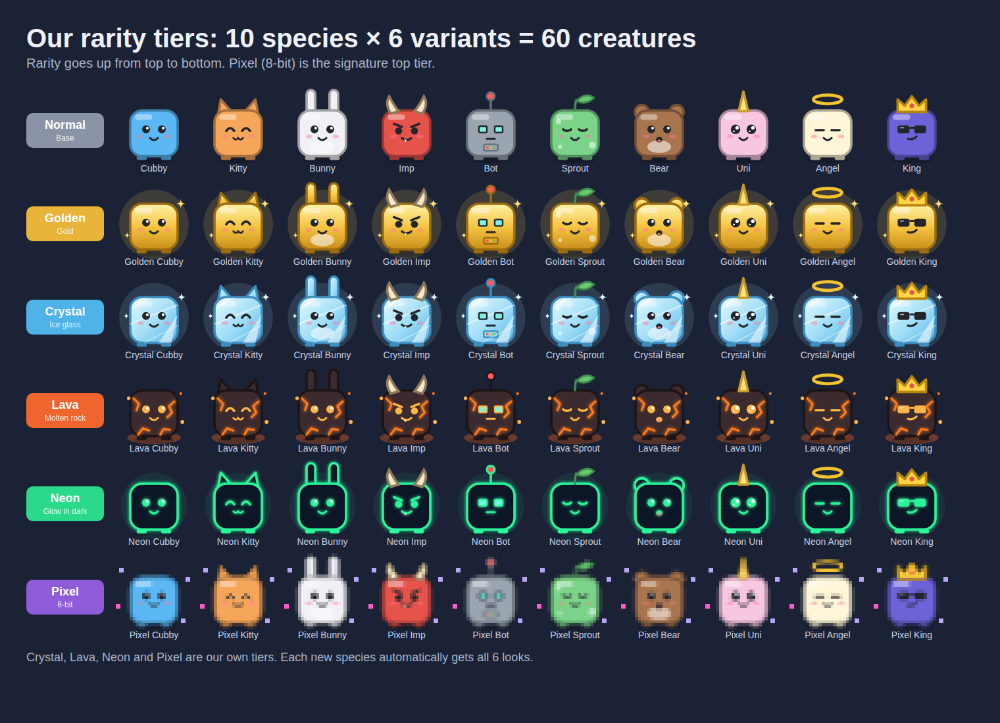
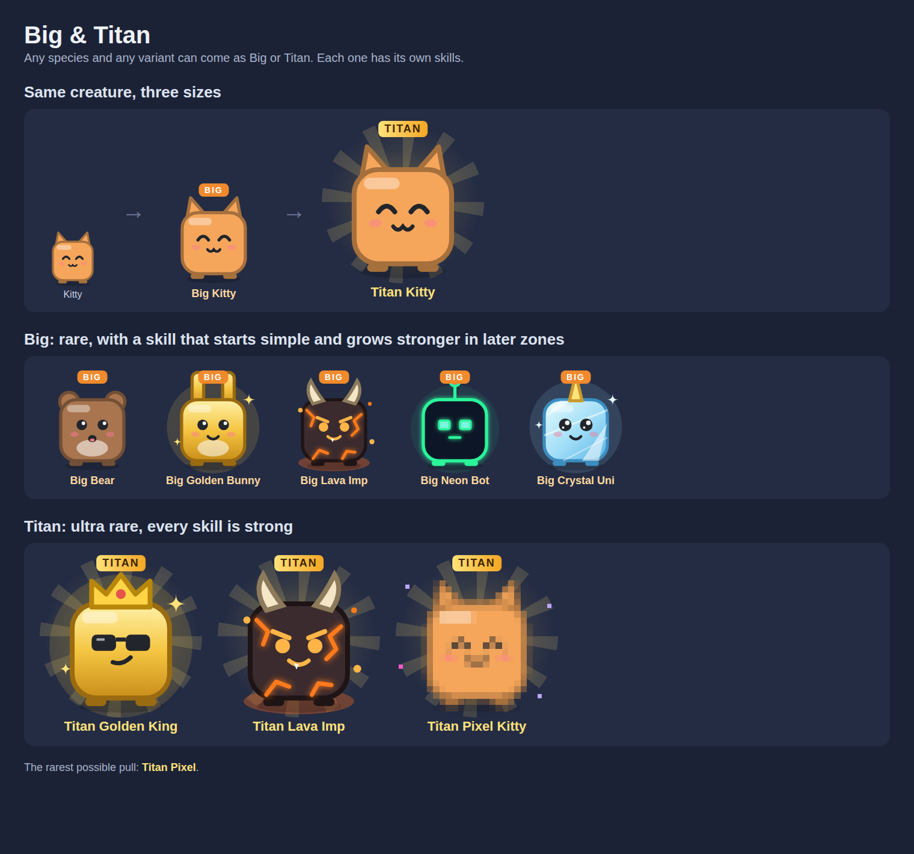

# وثيقة تصميم اللعبة (Game Design Document)

اسم اللعبة: **Cubelings**

هذي الوثيقة فيها الفكرة كاملة. **الأرقام الصحيحة في الكود:** `roblox/shared/Config/*.luau` و `roblox/shared/Logic/*.luau`، وإذا كاين فرق، الكود هو الصح. كل الأرقام تتضبط في التجربة.
تفاصيل العالم الأول (الخريطة، الأنواع) في [world-1.md](world-1.md)، والأدوات في [items.md](items.md). حاجة مكتوب عليها **مؤجل** ماهيش في اللعبة دركا.

---

## 1. الفكرة في سطرين

اللاعب يتمشى مع فريق مخلوقات مكعبة لطيفة، يجمع العملات من العالم، يفقس بيض باش يلقى مخلوقات أقوى وأندر، ويفتح مناطق جديدة.
العالم **ما تحمّلش كامل**: كل منطقة تبدا رمادية وبكسلات، وكل ما يجمع فيها ترجعلها الألوان والتفاصيل.

- **النوع:** جمع مخلوقات + فقس بالحظ + idle
- **الجمهور:** لاعبين صغار ومراهقين (8–16 عام) في السوق الأجنبي، نفس جمهور Pet Simulator 99
- **اللغة:** الإنجليزية
- **المنصة:** **Roblox** (3D)، فيها تبادل ومتجر (شوف الفصل 14)

### علاش مختلفة على Pet Simulator 99
| Pet Simulator 99 | لعبتنا |
|------------------|--------|
| المناطق في خط مستقيم | خريطة يختار فيها اللاعب طريقو |
| المخلوقات يختلفو في القوة برك | العناصر: كل درجة قوية في نوع من المناطق |
| Huge و Titanic = نفس الحيوان برقم أكبر | Big و Titan عندهم مهارات مختلفة تبان في اللعب |
| المنطقة ما تتبدلش | المنطقة ترجعلها الألوان من 0% لـ 100% |
| Shiny و Rainbow | درجات خاصة بينا: Crystal، Lava، Neon، Pixel |
| البيض والحظ يتباعو بفلوس | **البيض والحظ ما يتباعوش أبداً** |

---

## 2. الحلقة الأساسية

```
يضغط على مصدر عملات ← الفريق يجري يجمع ← العملات تتجمع
← يفقس بيض ← فريق أقوى ← يفتح منطقة جديدة ← بيض أغلى ومكافآت أكبر ← ...
```

- **بلا جولات:** اللاعب يبقى في المنطقة قد ما يحب، بلا وقت وبلا نهاية
- **الفقس بلا حدود:** يفقس قد ما يحب ما دام عندو عملات، بلا طاقة ولا انتظار
- **حتى في دقيقتين يخرج بحاجة:** بيضة، ولا تطوير، ولا نسبة في المنطقة
- **بداية سريعة:** بلا شرح طويل، اللاعب يتعلم وهو يلعب، وأول **Golden مضمون في أول 5 دقايق**

---

## 3. الشخصية والتحكم

- **اللاعب يلعب بالـ Avatar تاعو في Roblox،** والفريق يتبعو. ما نصمموش شخصية خاصة باللعبة
- **الأشكال اللي نزيدوها فوق الـ Avatar:** ألقاب، Trails، مركبات و Auras. المسار المدفوع في Battle Pass فيه غير هذو
- **التحكم:** التحكم العادي تاع Roblox (كمبيوتر وهاتف)، ويضغط على مصدر باش يبعث الفريق
- **الوضع التلقائي:** زر واحد، والفريق يختار المصادر وحدو
- **اللعب النشط أحسن من التلقائي:**
  - ضغطة اللاعب على مصدر تضرب تاني
  - الـ Combo ما يخدمش في الوضع التلقائي

---

## 4. المخلوقات

### 4.1 التصميم: جسم واحد
- **كل المخلوقات** مبنية على نفس الجسم: **مكعب** بستايل Roblox
- **الطبقات:** لون + وجه (عيون وفم) + قطعة فوق الراس + تأثير الدرجة
- **مخلوق جديد** = سطر بيانات جديد، ماشي رسمة جديدة



### 4.2 الأنواع
- **كل منطقة عندها بيضة فيها 4 أنواع**
- **الفرص:** 60% / 30% / 9% / 1%
- **العالم الأول:** 50 نوع: 40 في بيض المناطق + 10 أسطوريين في الـ Legendary Egg (القائمة في [world-1.md](world-1.md))

### 4.3 القوة
- **القوة = شحال من عملة يجمع المخلوق في كل ضربة**
- **كل مخلوق يضرب مرة في الثانية،** يعني القوة = عملات في الثانية
- **الرقم يبان على كل مخلوق،** وقوة الفريق = مجموع قوة المخلوقات

**قوة مخلوق = قوة النوع × الـ variant × الحجم × العنصر**

- **قوة النوع:** تكبر مع المناطق بنفس سلّم العملات (1، 10، 50، 250، 1.5K، 10K). في كل منطقة: 1 · 2 · 4 · 8 × السلّم. يعني من Cubby (1) حتى King (80K). الأسطوريين من 160K (Slime King) حتى 1.28M (Glitch)، ديما أقوى من أحسن مخلوق في المنطقة الأخيرة

| المنطقة | القوة (60% · 30% · 9% · 1%) |
|---|---|
| 1 | 1 · 2 · 4 · 8 |
| 2–3 | 10 · 20 · 40 · 80 |
| 4–5 | 50 · 100 · 200 · 400 |
| 6–7 | 250 · 500 · 1K · 2K |
| 8–9 | 1.5K · 3K · 6K · 12K |
| 10 | 10K · 20K · 40K · 80K |

- **علاش:** العملات تكبر ×10,000 من المنطقة 1 للـ 10، القوة لازم تكبر معاها، باش كل منطقة تتلعب بنفس الإيقاع والأرقام تولي كبار كيما PS99
- **الـ variant:** Normal x1 · Golden x1.5 · Crystal x2.5 · Lava x4 · Neon x6 · Pixel x10
- **الحجم:** Normal x1 · Big x3 · Titan x10
- **العنصر (حسب الـ variant):** Crystal x2 في مناطق Fire · Lava x2 في مناطق Ice · Neon x2 في مناطق Dark · Pixel x2 في Pixel Zone. هكذا كل variant عندو منطقة يلمع فيها
- **الفريق:** نجمعو قوة المخلوقات اللي لابسهم، ومن بعد قدرات الـ Big/Titan (مثلاً Power x3). قدرات من نفس النوع ما يتجمعوش: الأقوى برك
- **من برا المخلوقات:** upgrades بالعملات، الإكسيرات، Boost Cards، الـ Reload (x1.5 كل مرة)، والـ Stickers

**أمثلة:**
- Normal King في Pixel Zone: **80K**
- Golden Big Phoenix في Volcano: 12K × 1.5 × 3 = **54K**
- Crystal Ice Dragon في Volcano (Fire): 12K × 2.5 × 2 = **60K**
- Pixel Titan Glitch في Pixel Zone: 1.28M × 10 × 10 × 2 = **256M** (قريب من المستحيل)
- فريق كامل + قدرات Titan + Reload: الأرقام توصل **B**. العوالم الجاية (2–15) تكمّل السلّم وتوصل **T و Qa**

### 4.4 الدرجات
| الدرجة | الشكل | مضاعف القوة | فرصة الفقس | الدمج |
|--------|-------|-------------|---------------------|-------|
| Normal | عادي | ×1 | الباقي | — |
| Golden | ذهبي يلمع | ×1.5 | 1 / 50 | 5 Normal ← 1 Golden |
| Crystal | زجاج ثلج شفاف | ×2.5 | 1 / 250 | 5 Golden ← 1 Crystal |
| Lava | صخر أسود بشقوق تشعل | ×4 | 1 / 1,000 | من البيض برك |
| Neon | أسود يضوي في الظلام | ×6 | 1 / 5,000 | من البيض برك |
| Pixel | المخلوق يولي بكسلات 8-bit | ×10 | 1 / 50,000 | من البيض برك |

### 4.5 العناصر
كل درجة قوية **×2** في نوع من المناطق، وتبان على المخلوق علامة "×2":

| الدرجة | قوية في |
|--------|---------|
| Lava 🌋 | مناطق الثلج ❄️ |
| Crystal 🧊 | مناطق النار 🔥 |
| Neon 💚 | المناطق المظلمة 🌑 |
| Pixel 🟪 | مناطق Pixel |
| Golden 🟨 | مناطق الكنز 💰 (من العالم 2) |

النتيجة: اللاعب يبدل فريقو حسب المنطقة.

### 4.6 Big و Titan


- **ماشي نسخة مكبّرة:** كل Big وكل Titan عندو **مهارة خاصة** حسب النوع
- **مهارات Big:** تبدا بسيطة وتقوى مع المناطق
- **مهارات Titan:** **كلها قوية**، حتى في المنطقة الأولى، لأن Titan نادر بزاف. كل Titan عندو جوج:
  - **دايماً:** مضاعف كبير يخدم طول الوقت (مثلا قوة كل المخلوقات ×5، كل بيضة تعطي 3)
  - **قدرة كبيرة:** تخدم وحدها كل شوية، بحركة ومؤثرات تبان (Lightning، Tornado، Tsunami، Earthquake، Clone Army...)
  - **الفرق مع Pet Simulator 99:** القدرات القوية مربوطة بالـ Titan وتخدم وحدها، وكل Titan يجمع مضاعف دائم + قدرة كبيرة
- **نفس المهارة ما تتجمعش:** تتحسب الأقوى برك
- **القوة:** Big = ×3 من قوة النوع، Titan = ×10، وفوقها المهارة
- **وين يتجابو:**

| | من البيض | من العالم |
|-|------------------|-----------|
| **Big** | 1 / 10,000 | يظهر فجأة في المنطقة (حوالي مرة كل 10 دقايق، ويهرب بعد 3 دقايق). فيه عملات قد 5% من هدف المنطقة. كي تغلبو، **10%** فرصة يتبعك (حتى 50% بالمهارات)، ومضمون في المحاولة 10 |
| **Titan** | 1 / 2,000,000 | **حارس المنطقة:** يطلع كي ترجّعها لـ 100%. كي تغلبو تاخذ مكافأة كبيرة و **0.1%** فرصة تروّضو (+0.005% كل مرة تخسر، ومضمون في المحاولة 500). يرجع كل 4 ساعات |

- **أندر مخلوق في اللعبة:** Pixel Titan Glitch (أسطوري)

### 4.7 الفريق
- **البداية:** 6 أماكن، و **الحد 12 للكل**
- **أماكن زايدة بالعملات** (تطوير Team Slot):

| المكان | 7 | 8 | 9 | 10 | 11 | 12 |
|--------|---|---|---|----|----|----|
| الثمن | 1K | 10K | 100K | 1M | 10M | 100M |

- **VIP (+1) و +2 Team Slots (+2):** يعطيو الأماكن **بكري** برك، والحد يبقى 12
- **أماكن بالفيديو:** مؤجل (ما كانش)

### 4.8 المخزن
- **البداية:** 100 مخلوق
- **التوسيع:** +50 بالعملات (18 مستوى، حتى 1,000)، +50 في متجر الجواهر (حتى 10 مرات)، Rank (+25/+50/+100)، و Big Storage (+500، Robux)
- **حذف تلقائي:** في الإعدادات، يحذف وحدو الـ Normal ولا الـ Golden اللي عندك ديجا (الجداد ديما يتخلاو)
- **قفل:** يقفل المخلوقات اللي يحبها باش ما تتحذفش بالغلط

### 4.9 الدمج
- **آلة Golden:** 5 Normal من نفس النوع ← 1 Golden
- **آلة Crystal:** 5 Golden من نفس النوع ← 1 Crystal
- **Deer Titan:** الدمج بـ 2 بدل 5
- **Fusion Token والإعلان "ادمج بـ 4":** مؤجل (ما كانش في اللعبة)

### 4.10 الكتاب (Index)
- **كل نوع بكل درجة** يتسجل كي تلقاه أول مرة
- **العالم الأول:** 50 × 6 = **300 تسجيل**، حتى اللي جاو بالتبادل. الإنجاز Collector يعطي جواهر ولقب
- **مؤجل:** +0.5% عملات على كل تسجيل، وكتاب Titans منفصل

---

## 5. البيض والفقس

- **كل منطقة عندها بيضة،** وثمنها يطلع مع المناطق (الأثمان في [world-1.md](world-1.md))
- **الفرص تبان دايماً** على البيضة، باش اللاعب يعرف واش يستنى
- **الفرص ما تتنقصش بلا ما نقولو:** أي تبديل يتعلن في سجل التحديثات قبل ما يصرا
- **الفقس:** حركة قصيرة (حوالي 1.5 ثانية) تتعدى بضغطة. المخلوقات النادرة عندها حركة وصوت خاص
- **فقس متعدد** (تطويرات بالعملات):
  - **×3:** 3 بيضات في ضربة
  - **×8:** 8 بيضات في ضربة
  - **فقس تلقائي:** يفقس وحدو
- **الحظ:**
  - **الأنواع النادرة** (أقل من 10%): الحظ يخدم بالجذر التربيعي، باش الأنواع العاديين يبقاو عاديين
  - **الدرجات والأحجام:** الحظ كامل حتى ×10، من بعد بالجذر التربيعي، وحد أقصى **×100** للدرجات و **×25** لـ Big/Titan. هكذا Pixel و Titan يبقاو نادرين حتى كي تتجمع الـ boosts
  - **الأسطوريين:** الحظ ما يبدّلش فرصتهم
  - يجي من: مهارات المخلوقات، الإكسيرات، Boost Cards، الملصقات، Luck Totem، الإعلانات، الأحداث، Live Events، و **Luck ×2 لمدة 30 دقيقة بلاش كل نهار** (بلا فيديو)
  - **ما يتباعش بفلوس أبداً**

---

## 6. مصادر العملات

### 6.1 الأنواع (المنطقة 1)
| المصدر | العملات اللي فيه | يعاود يخرج بعد |
|--------|------------------|----------------|
| كومة 🪙 | 50 | 5 ثواني |
| صندوق 📦 | 500 | 30 ثانية |
| خزنة 🔒 | 5,000 | دقيقتين |
| خزنة عملاقة 🏦 | 50,000 | 10 دقايق |

- **في المناطق الجاية:** العملات تتضرب في سلّم المنطقة (1، 10، 50، 250، 1.5K، 10K)
- **المصدر يفرغ** كي الفريق يجمع العملات اللي فيه

### 6.2 باش يكون الجمع ممتع
- **الإحساس:** العملات تنفجر وتطير للاعب بصوت "تشينغ"
- **Combo:** كل مصدر يتكسر يزيد العداد. إذا عدّا 5 ثواني بلا ما يكسر حتى مصدر، العداد يرجع للصفر

| العداد | مضاعف العملات |
|--------|---------------|
| 0–4 | ×1 |
| 5–9 | ×1.5 |
| 10–19 | ×2 |
| 20–49 | ×3 |
| 50+ | ×5 |

- **Jackpot:** 1% من المصادر ينفجرو **×10**

### 6.3 حوايج تصرا في المنطقة
- **كاينين:** Big يتمشى (الفصل 4.6)، حارس المنطقة، Pixel Rift (7.5)، World Boss كل ساعة في المدينة، وقدرات Titan (مطر عملات، صناديق ذهبية، Tsunami...)
- **مؤجل:** أحداث عشوائية في المنطقة (صندوق ذهبي كل 5 دقايق، مطر عملات، صندوق Pixel، صندوق بالفيديو)

---

## 7. العوالم والمناطق

### 7.1 الخريطة
- **15 عالم،** كل واحد بموضوع وميكانيكية خاصة: [worlds.md](worlds.md)
- **اللعبة مقسومة لعوالم،** وكل عالم خريطة مربعات (مناطق)
- **اللاعب يختار طريقو:** كل منطقة يفتحها تبانلو المناطق اللي جنبها
- **كل منطقة:** أرض مفتوحة، فيها مصادر عملات، بيضة خاصة، وعنصر


### 7.2 البوابات
| المستوى في الخريطة | المناطق | ثمن البوابة |
|--------------------|---------|-------------|
| 2 | Flower Field، Forest | 5K |
| 3 | Beach، Mushroom Cave | 50K |
| 4 | Desert، Snow Peak | 250K |
| 5 | Volcano، Frozen Lake | 1.5M |
| 6 | Pixel Zone | 10M |

- **تبديل الطريق:** جسر بين Beach و Mushroom Cave، وتفتح المنطقة الأخرى بنفس ثمن بوابتها

### 7.3 المنطقة تحيا (0% ← 100%)
- **كل منطقة تبدا رمادية وبكسلات** (ما تحمّلتش)
- **كل عملة تتجمع فيها** تطلّع النسبة، والألوان ترجع شوية بشوية
- **100%** = تجمع في المنطقة **4 مرات ثمن البوابة الجاية** (`restoreGoal` في World1.luau)
- **في 100%:**
  - يطلع **حارس المنطقة (Titan)**
  - المنطقة تعطي **أرباح دائمة** وانت غايب

### 7.4 حارس المنطقة
- **شكون هو:** أندر نوع في بيضة المنطقة، في شكل Titan
- **المعركة:** الفريق يجمع العملات اللي فيه، كيما مصدر ضخم
- **كي يطيح:** عملات (نص هدف المنطقة)، **جواهر 10 × رقم المنطقة**، إكسيرات، وفرصة لبطاقة، ملصق، أداة ونص Titan Key، و **0.1%** فرصة تروّضو (+0.005% كل مرة تخسر، مضمون في 500)
- **أول مرة تغلبو (First clear):** Coins +5% للأبد و 100 × رقم المنطقة جواهر
- **يرجع:** كل 4 ساعات، ولا دركا بـ **Titan Key**
- **إعلان "محاولة زايدة":** مؤجل

### 7.5 Pixel Rift (يومي)
- **كل يوم** منطقة عشوائية ترجع بكسلات
- **فيها:** عملات ×1.5 وفرصة Pixel ×3، وعلامة بنفسجية في العالم، ومهام خاصة (يومية وأسبوعية)
- **Rift Key:** يفتح Rift 3 دقايق في المنطقة اللي راك فيها، للكل
- **سبب يرجع اللاعب كل يوم:** "وين الـ Rift اليوم؟"

---

## 8. التطويرات (بالعملات)

الأثمان في `roblox/shared/Config/Upgrades.luau`.

| التطوير | المستويات | الأثر |
|---------|-----------|-------|
| Team Slot | 6 | +1 مكان في الفريق (حتى 12) |
| Coin Multiplier | 10 | +25% عملات في كل مستوى |
| Tap Power | 5 | الضغطة تزيد جزء من قوة الفريق (5% ← 30%) |
| Walk Speed | 5 | +10% في كل مستوى |
| Storage | 18 | +50 مكان في كل مستوى |
| Offline Time | 5 | +2 ساعات (من ساعتين حتى 12 ساعة) |
| Triple Hatch | مرة وحدة | 3 بيضات في ضربة |
| Octo Hatch | مرة وحدة | 8 بيضات في ضربة (بعد Triple) |
| Auto Hatch | مرة وحدة | يفقس وحدو وانت حدا البيضة |

- **مدى المغناطيس:** ماشي تطوير. يجي من مهارات Big (Bee، Deer، Bat، Narwhal)

---

## 9. العملات

| العملة | كيفاش تجي | فيماش تتصرف | تتباع بفلوس؟ |
|--------|-----------|-------------|---------------|
| **Coins** 🪙 | المصادر، الأحداث، الحراس | البيض، البوابات، التطويرات، الأماكن | ❌ |
| **Gems** 💎 | المصادر (نادر)، مهارات بعض المخلوقات، الحراس، World Boss، المهام، Bounty، Journey، Achievements، Battle Pass | متجر الجواهر، Trading Plaza، إنشاء Clan | ❌ |
| **Tickets** 🎟️ | المهام، الرحلات، Bounty، World Boss، Cube Stack، هدايا وقت اللعب | Lucky Spin (5 تذاكر الدورة) | ❌ |
| **توكنز الأحداث** 🍬 | كسر المصادر وقت الحدث | متجر الحدث | ❌ |

**قاعدة:** حتى عملة ما تتباعش بفلوس حقيقية، باش البيض والحظ يبقاو عادلين.

---

## 9.1 الأدوات والأنظمة

كل الأدوات والأنظمة الإضافية مكتوبة بالتفصيل في [items.md](items.md):

| النظام | باختصار |
|--------|---------|
| **Boost Cards** (الكتب) | بطاقات 8-bit تعطي قوة دائمة، 5 درجات، ومجموعات |
| **Elixirs** (الإكسيرات) | boosts بالوقت، وآلة خلط تعطي إكسيرات مزدوجة |
| **Keys** (المفاتيح) | خزنة كنز، صندوق ذهبي (بيض Golden)، Pixel Rift، نداء الحارس |
| **Stickers** | ملصقات تبان على وجه المخلوق وتقويه |
| **Gadgets** | قنابل، مطر، Totems |
| **Rides** | مركبات للشخصية (شكل وسرعة) |
| **Expeditions** | رحلات للمخلوقات اللي ما تستعملهمش |
| **Arcade** | Lucky Spin و Cube Stack |
| **Gifts** | هدايا وقت اللعب، وهدية للصاحب مرة في النهار |
| **Fishing Pond** | صيد في المدينة، و Fish Index |
| **World Boss و Clans** | Boss كل ساعة للسيرفر كامل، و Clans بترتيب أسبوعي |
| **Rank** | رتبة اللاعب ومكافآت دائمة |
| **Reload** | تعاود من الأول بمضاعف دائم (الـ Rebirth تاعنا) |
| **Achievements** | إنجازات وألقاب |
| **Hub** | المدينة وكل الآلات |

---

## 10. الرجوع اليومي

- **أرباح الغياب:** المخلوقات يجمعو وانت غايب (حتى الحد اللي فتحتو)
- **Pixel Rift** يومي
- **مكافأة الدخول:** دورة 7 أيام، واليوم 7 فيه مكافأة كبيرة
- **Streak:** إذا ضيّعت يوم تنقطع السلسلة. تقدر تنقذها **بالفيديو برك** (إذا ضيّعت حتى 3 أيام)، وما تتباعش بـ Robux لأن اليوم 7 فيه إكسيرات حظ
- **Luck ×2 بلاش:** 30 دقيقة كل نهار، بلا فيديو (اللاعبين تحت 13 ما يشوفوش الإعلانات)
- **مهام:** 3 يومية و 5 أسبوعية، تعطي خبرة Battle Pass. ما تعطيش مهمة ما يقدرش اللاعب يديرها (Rift، Trips، الحراس)
- **🎯 Daily Bounty:** 3 مخلوقات تفقّسهم كل نهار. المكافأة: سهل 💎 10 + 🎟️ 1، متوسط 💎 25 + 🎟️ 2، صعب 💎 60 + 🎟️ 4، والثلاثة: 💎 40 + Golden Key + نص Rift Key (`Config/Bounty.luau`)
- **📖 Journey:** 30 مرحلة مع Professor Cubo، من "كسّر 20 مصدر" حتى "اغلب 25 حارس" (فيها "اصطاد 10 حوتات"). آخر مرحلة تعطي لقب Valley Hero (`Config/Journey.luau`)
- **هدايا وقت اللعب:** هدية كل 15 دقيقة، 8 في النهار
- **حراس المناطق** يرجعو كل 4 ساعات، و **World Boss** كل ساعة
- **أحداث محدودة الوقت بلا FOMO قاسي:** تعطي أشكال وحوايج، ماشي مخلوقات أقوى. التوكنز: كومة 5% فرصة، صندوق 0.4، خزنة 1، خزنة عملاقة 2، Big 5، حارس 15، Boss 20 (`Config/Events.luau`)

---

## 11. Battle Pass

- **الموسم:** 30 يوم، 50 مستوى، **200 XP للمستوى** (10,000 XP، تقريباً 17 يوم مهام)
- **الخبرة:** من المهام اليومية والأسبوعية، مثلا:
  - "اجمع 1M عملة"
  - "فقّس 100 بيضة"
  - "رجّع منطقة لـ 100%"
  - "اغلب حارس"
  - "العب في Pixel Rift"
- **المسار المجاني:** حاجة في كل مستوى: عملات، جواهر، إكسيرات، وبيض مجاني
- **المسار المدفوع:** أشكال **للشخصية برك** (ألقاب، Trails، ومركبات Comet Board و Cloud)
  - المخلوقات يبقاو كيما هوما: ما كاينش أشكال للمخلوقات ولا مخلوق حصري
  - ما فيه لا بيض لا حظ
- **الإعلانات:** تبديل مهمة يومية (3 في النهار). خبرة ×2 بالفيديو: مؤجل

---

## 12. الربح (Roblox)

### 12.1 القواعد
- **الربح من Robux:** Developer Products، Game Passes، Premium Payouts، ولوحات الإعلانات
- **البيض، الحظ، المخلوقات والعملات ما يتباعوش بـ Robux أبداً.** نبيعو الوقت والراحة والشكل برك
- **علاش:** هكذا اللعبة عادلة، وبيع البيض يتحسب عند Roblox "paid random items": يلزم نورّيو الفرص، وفيه بلدان ممنوع
- **نقطة قوة نكتبوها في الصفحة:** *"No pay-to-win eggs"*

### 12.2 Developer Products (يتشراو بزاف مرات)
| المنتج | الثمن (مقترح) | فيه |
|--------|---------------|-----|
| Coins ×2 · 30 دقيقة | R$ 49 | عملات مضاعفة |
| Power ×2 · 30 دقيقة | R$ 49 | قوة الفريق مضاعفة |
| Server Boost | R$ 149 | عملات ×2 **لكل اللاعبين** في السيرفر 15 دقيقة، والكل يشوف شكون شراه |
| كمّل الرحلة دركا | R$ 25 | المخلوقات يرجعو فوراً، بعملات وجواهر برك (بلا إكسيرات، مفاتيح ولا تذاكر) |
| ضاعف عملات الرحلة | R$ 35 | العملات ×2 (الحوايج لا، لأنهم عشوائيين) |
| بدّل مهمة | R$ 10 | مهمة يومية جديدة |
| Battle Pass Premium | R$ 399 | ألقاب، Trails ومركبات |
| لقب Supporter | R$ 49 | شكل برك |
| Auras (6): Sparkle، Frost، Flame، Toxic، Pixel، Galaxy | R$ 79–149 | particles حول اللاعب، الكل يشوفها. شكل برك |
| Hatch effects (4): Confetti، Golden، Pixel، Galaxy | R$ 79–129 | احتفال أجمل في شاشة الفقس. **نفس الحظ**، شكل برك |

- **أنقذ السلسلة:** ما تتباعش بـ Robux، بالفيديو برك

> **علاش ما نبيعوش Luck ×2:** الحظ يبدّل واش يخرج من البيض، يعني Robux يشري جوائز عشوائية (pay to win، ومشكل مع قوانين Roblox). Auras و Hatch effects يعطيو نفس الإحساس "أنا مميز" بلا ما يمسو الحظ. Luck ×2 يبقى غير بالفيديو (مجاني).

### 12.3 Game Passes (مرة وحدة، ديما)
| الـ Pass | الثمن (مقترح) | فيه |
|----------|---------------|-----|
| VIP | R$ 199 | +1 مكان في الفريق بكري (الحد يبقى 12)، +4 ساعات غياب، لقب VIP |
| Auto Tap | R$ 149 | ضغطتين في الثانية وحدهم |
| +2 Team Slots | R$ 299 | جوج أماكن دركا، قبل ما تشريهم بالعملات (الحد يبقى 12) |
| Big Storage | R$ 99 | مخزن +500 |
| Teleport | R$ 79 | تروح لأي منطقة مفتوحة |
| Extra Trip | R$ 149 | +1 مكان رحلة (هذيك الرحلة ترجع بعملات وجواهر برك) |

### 12.4 بلا ما يشري اللاعب حتى حاجة
- **Premium Payouts:** Roblox يخلصنا على الوقت اللي يقعدو فيه لاعبين Premium. نعطيوهم عملات +10% باش يقعدو أكثر
- **لوحات الإعلانات (Immersive Ads):** جوج لوحات في المدينة، تربح كي يشوفوها اللاعبين

### 12.5 الفيديو بمكافأة (زيادة برك)
- **يبانو غير** للاعبين 13 سنة وأكثر في بعض البلدان، ومن بعد ما اللعبة توصل لشروط Roblox (2,000 زائر في الشهر)
- **الأزرار تتخبى** كي ما يكونش فيديو، وكل مكافأة مهمة عندها نسخة بـ Robux
- **اللحظات:** حظ ×2، 3 بيضات، عملات ×2، قوة ×2، إكسير كل ساعة، الرحلات، السلسلة، المهام، و Lucky Spin (الحدود في `Config/Products.luau`)
- **Lucky Spin ما يتباعش بـ Robux** لأن الجوائز عشوائية

---

## 13. الواجهة

### 13.1 الشاشة الرئيسية
- **فوق:** العملات، الجواهر، قوة الفريق
- **شريط المنطقة:** النسبة 0% ← 100%
- **عداد الـ Combo:** يبان كي يكون فوق ×1
- **أزرار تحت:** البيض، الفريق، التطويرات، الخريطة، Battle Pass، المحل
- **زر الوضع التلقائي**

### 13.2 الشاشات
1. **الفقس:** البيضة، الفرص، أزرار ×1 / ×3 / ×8 / تلقائي، وزر حظ ×2 بالفيديو
2. **الفريق:** المخلوقات المجهزين، والمخزن بترتيب حسب القوة، وزر "جهّز الأقوى"
3. **الكتاب:** كل الأنواع والدرجات، وكتاب Titans
4. **الخريطة:** المناطق، البوابات، نسبة كل منطقة، ووين الـ Rift اليوم
5. **التطويرات**
6. **الدمج**
7. **Battle Pass والمهام**
8. **المكافأة اليومية**
9. **المحل:** متجر الجواهر، Robux (Passes، boosts، أشكال)، والفيديو بلاش
10. **الإعدادات**

---

## 14. Roblox والتبادل

**المنصة: Roblox** (مقرر). الجمهور موجود (نفس جمهور PS99)، والتبادل واللعب الجماعي مجاناً، واللغة Luau.

- **قاعدة البيض:** على Roblox بيع البيض والحظ هو العادي. قاعدتنا تبقى، وتولي **نقطة قوة** تفرقنا
- **التبادل** يعطي قيمة كبيرة للمخلوقات النادرة، ولازم يكون آمن (الاحتيال من أكبر الشكاوي في PS99). كيفاش مبرمج (القفل 3 ثواني، التأكيد، السجل، قيمة التبادل، Trading Plaza) مكتوب في [dev.md](dev.md)
- **شروط الإعلانات عند Roblox:** في [player-feedback.md](player-feedback.md#5-معلومات-على-roblox-إعلانات-الفيديو-بمكافأة)

---

## 15. الرسومات والصوت

- **Low-end mode من النهار الأول:** يحي المؤثرات الثقيلة، باش اللعبة تخدم على الهواتف الضعيفة (الـ lag من أكبر الشكاوي في PS99)
- **مؤثرات فرحة** في كل مكافأة: confetti، ضوء، صوت

- **المخلوقات:** مكعبات لطيفة بطبقات (الفصل 4.1)
- **المناطق:** أرض بلوكات بسيطة، لون مختلف لكل منطقة. قبل ما تتصلح تبان رمادية وبكسلات
- **Pixel:** المخلوقات والمناطق تتحول لبكسلات 8-bit. هذي هي هوية اللعبة، وتتناسب مع عالم المكعبات
- **المؤثرات:** انفجار العملات، ضوء الفقس، دقة Stomp، ورجفة الشاشة في Smash
- **الصوت:**
  - "تشينغ" للعملات
  - طبلة قبل الفقس
  - صوت خاص لكل درجة نادرة
  - موسيقى خفيفة تتبدل حسب المنطقة

---

## 16. مازال ما تقررش

- حتى حاجة دركا. الشخصية هي الـ Avatar تاع Roblox، ونركزو على اللعبة.

---

## الأسطوريين و الـ Legendary Egg

- كل منطقة عندها بيضتها (4 مخلوقات: 60% / 30% / 9% / 1%)، ما فيهاش أسطوريين
- في آخر منطقة (Pixel Zone) كاين **★ Legendary Egg** (ثمنها 5 مرات بيضة المنطقة). أغلب الوقت تعطي مخلوقات المنطقة، و فيها 10 أسطوريين بحظ قريب من المستحيل:

| الأسطوري | المنطقة (الشكل) | الحظ | القوة | قدرة Titan |
|---|---|---|---|---|
| Slime King | Spawn Meadow | 1 in 200K | 160K | Power x3، كل دقيقة 5 slimes يكسرو مصادر |
| Blossom Queen | Flower Field | 1 in 300K | 192K | Luck x6، كل 2 دقايق 3 بيضات بحظ x10 |
| Elder Treant | Forest | 1 in 400K | 224K | Power x3، كل 30 ثانية الأرض تهتز |
| Kraken | Beach | 1 in 600K | 272K | Power x3.5، موجة تكسر المنطقة كل 45 ثانية |
| Spore Sage | Mushroom Cave | 1 in 800K | 320K | Gems x3، مطر جواهر |
| Pharaoh Scarab | Desert | 1 in 1M | 384K | Coins x3، كل 2 دقايق Coins x15 |
| Aurora Wolf | Snow Peak | 1 in 1.5M | 480K | Power x4، 10 ذئاب أشباح |
| Inferno Drake | Volcano | 1 in 2.5M | 608K | Power x5، نيزك كل 20 ثانية |
| Frost Leviathan | Frozen Lake | 1 in 4M | 800K | يعطي الكل قوة أقوى مخلوق، 20 صندوق ذهبي كل دقيقة |
| Glitch | Pixel Zone | 1 in 10M | 1.28M | Power x6، Coins x25 و بيضة بحظ x100 |

- الأرقام هي نفسها تاع `LEGENDARY_ODDS` والقوة في `World1.luau`
- **الـ Luck ما يبدّلش حظ الأسطوريين** (لا الفيديو، لا الإكسيرات، لا الكروت). يبدّل غير الـ variant و الحجم، يعني Golden Glitch ممكن
- كي يخرج أسطوري: رسالة للسيرفر كامل و احتفال كبير
