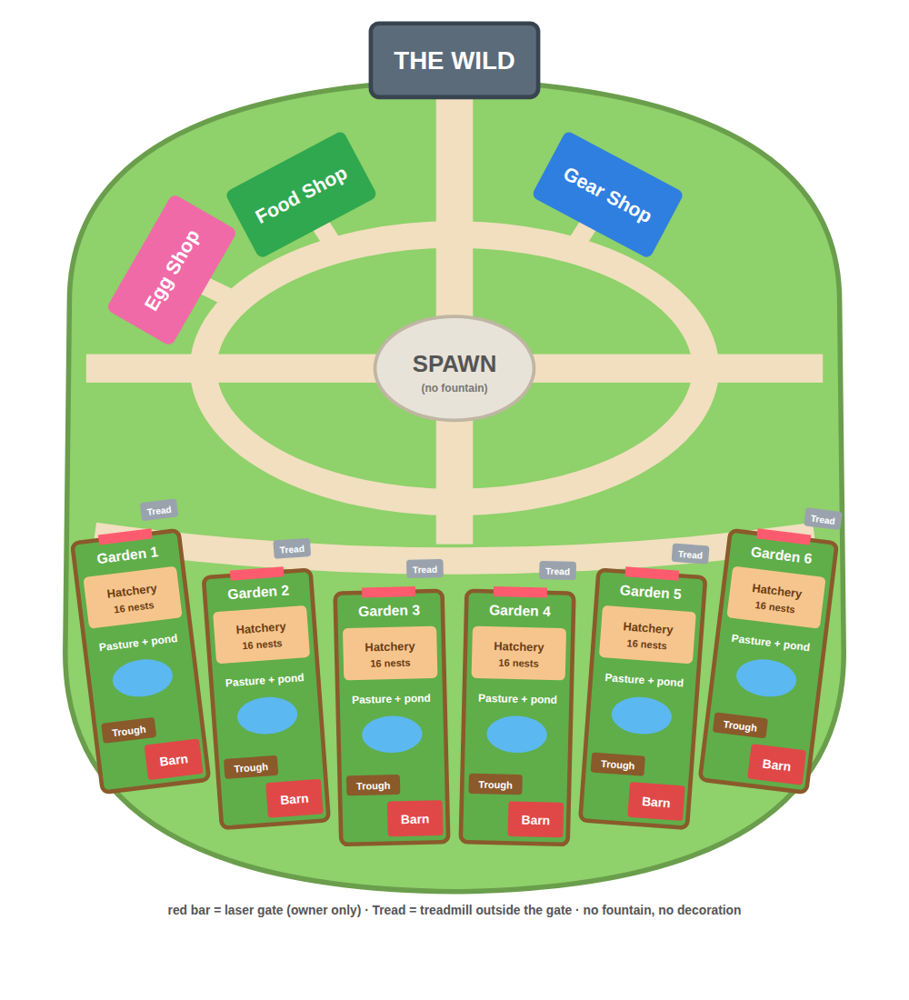

# Cubeling Nest

الكود في `game/` (يتبنى في Roblox بـ `default.project.json`).

## الماب
- **في الوسط ساحة مدوّرة** (بلا نافورة) وين يظهرو اللاعبين. دايرين بيها طريق دايري.
- **الفوق (الشمال):** **3 محلات** في قوس، كل واحد يشوف للساحة وعندو طريق: 🥚 **Egg Shop**، 🌾 **Food Shop**، 🏏 **Gear Shop**.
- **في وسط الفوق:** طريق مستقيم من الساحة لـ **البوابة الكبيرة 🌿 THE WILD** (برجين وقوس)، والبرية ماب منفصلة وراها.
- **التحت (الجنوب):** **6 حدائق** جنب بعض في قوس، أبوابهم يشوفو للساحة، وطريق قوسي يفوت قدّام كامل الأبواب. كل لاعب في السيرفر ياخذ حديقة.
- **بلا ديكور زايد** باش ما يكونش lag.
- **كل حديقة** (80×80) دايرين بيها سياج خشب، وفيها **بوابة ليزر** تشوف للساحة. البوابة مفتوحة ديما لصاحبها، ومسكّرة على الآخرين.
  - **باب الحديقة** يدخل طول للمفقس، وفوق الباب اسم صاحب الحديقة. المرعى ياخذ الباقي حتى للسياج اللوراني، في وسطه بركة.
  - **Hatchery قدّام الباب:** أرضية خشب فيها 16 عش (8 على كل جنب من الممرة، صفّين من 4). البيضة تبان بنفس الحجم في العش مهما كانت. كل عش فوق قاعدة حجر وتحت قبة زجاج. الأول حلقتو ذهبية (فيه تبدا البيضة المجانية).
  - **Pasture:** مرعى كبير (72×53) فيه بركة، المخلوقات يدورو فيه وتطلع فوقهم الدراهم.
  - **المرعى يكبر بالدراهم 🌳:** من الشكارة (**Bigger**) يزيد للور، بعيد على الساحة: +20، +40، +60 خطوة (10K، 200K، 4M). السياج والحشيش يتبعوه، والمخلوقات يدورو في البلاصة الجديدة.
  - **المذود (Trough):** تحط فيه الماكلة (🌾 5 دقايق، 🫐 15، 🍎 60) والمخلوقات تربح ×2. الثمن 30% من الربح الزايد. بلا ماكلة يربحو عادي.
  - **Treadmill:** **برا، قدّام باب الحديقة** بجنب البوابة، الطريق كامل يشوفك. تجري فوقو وكل **ثانية** تاخذ ⚡ (يطلع فوق راسك). **يبدا +1**، والـ console تاعو يكبّرو **بالدراهم** (كيما Steal an Egg، بلا Robux): +2 (500)، +5 (3K)، +10 (15K)، +25 (75K)، +50 (400K)، +100 (2M)، +250 (10M)، +500 (50M)، +1K (250M).
  - **المخزن (Storage):** حانوت في زاوية المرعى يفتح الشكارة. يهز 60 مخلوق، ويكبر لـ100 ومن بعد 150 بالدراهم.

  

## أول دقيقة
- **لاعب جديد** يلقى بيضة مجانية حاطّة في العش الذهبي تاعو، تفقس في **30 ثانية** (`STARTER_HATCH`).
- **خيط ذهبي** (`Controllers/Guide`) يدلّو وين يروح: العش، ومن بعد Egg Shop. يختفي كي يفقّس 3 مخلوقات.
- ما ينضربش بالمضرب وما يتشدش في الفخ في أول 15 دقيقة.

## الحركة
- **Sprint 🏃:** شد **Shift** (ولا زر **Sprint** في الهاتف) وتجري **×2** قد ما تحب، بلا طاقة. ما يخدمش وانت هاز بيضة.
- **الكرسي الطاير ☁️** (`SeatModel` و `RideClient`): اللاعب يبدا يمشي عادي. زر **☁️ Seat** يطلّعو على الكرسي (يقعد متكتّف الرجلين وهو يطير)، و **🚶 Walk** ينزّلو.
  - **على الكرسي:** يمشي **×4** من سرعتو (مشيو الحقيقي من ⚡)، حتى **120** على الأكثر.
  - **وهو هاز بيضة** (البرية، الـ Heist) الكرسي ما يزيدش السرعة، باش المطاردة تبقى عادلة.
  - الكل عندو **Cloud** بلاش. الـ 30 كرسي الآخرين شكل برك (نفس السرعة)، ويتباعو من بعد بالـ Robux.

## اللعب
1. **تشري بيض** من Egg Shop. الستوك يتجدد كل 5 دقايق، وهو نفسو في كل السيرفرات. البيض النادر قليل ما يكون في الستوك.
   - كي تجي بيضة نادرة (مستوى 9 وفوق)، السيرفر كامل يشوف "🌟 ICE EGG IN STOCK!".
   - **الحظ يبان:** كل بيضة في Shop مكتوب تحتها شنو يفقس منها وبقداش %، والطفرات مكتوبين الفوق.
2. **تحط البيضة في حاضنة** في حديقتك. تفقس بالوقت الحقيقي، حتى وانت خارج: دقيقة للمستوى 1، قريب ساعة للأسطورية.
3. **المخلوق يعيش في حديقتك** ويجيبلك دراهم كل ثانية، وحتى وانت خارج (8 سوايع على الأكثر).
4. **الطقس** يتبدّل كل 10 دقايق: البيضة اللي تكمل في طقس خاص تفقس على الأقل بنفس الطفرة (Golden، Crystal، Lava، Neon).
5. **من الشكارة (Bag):** تحط المخلوقات في الحديقة، ترجّعهم، ولا تبيعهم، وتشري بلاصة زايدة. الحاضنات الزايدة تشريهم في الحديقة نيشان.
6. **الحديقة آمنة ديما 🔒:** البوابة الليزر ما تخلّي يدخل غير صاحبها، وحتى واحد ما يقدر يسرق من حديقة. السرقة غير في **البرية** و**الـ Heist**.
7. **أم المكعبات (Mother Cube)** (`Config/Mother`):
   - **وقتاش:** كل ساعة على **xx:35**، مكعبة عملاقة جوعانة تنزل فوق الساحة لمدة دقيقتين. يتقال للكل قبل بدقيقة. في Studio تجي كل 5 دقايق للتجربة.
   - **كيفاش:** الكل يأكّلها مع بعض (**Feed**). تاخذ أصغر ماكلة عندك (🌾 = 1، 🫐 = 3، 🍎 = 10)، ولا تشري snack 🍪 بـ 60 ثانية من ربح حديقتك (= 1).
   - **الجوع:** 6 نقاط على كل لاعب في السيرفر (8 على الأقل).
   - **إذا شبعت:** كل واحد أكّلها ياخذ بيضة من أحسن مستوى فقّسو، وكل نقطة عطاها تزيد **2%** حظ باش تكون **Legendary Egg** (حتى 25%).
   - **إذا ما شبعتش:** تروح وما تعطي والو.
8. **Cube Snap 🧊** (`Config/Snap`): من الشكارة، زر "🧊 Snap" يبان كي يكون عندك 4 كيف كيف.
   - **4 مخلوقات** من نفس النوع ونفس الطفرة = **Mega** (أكبر، يربح ×5، يحرس ×2).
   - **4 Mega** من نفس النوع (أي طفرة) = **Rainbow** 🌈 (أكبر بزاف، يضوي بالألوان، يربح ×25، يحرس ×4)، وياخذ أحسن طفرة فيهم. السيرفر كامل يشوف.
   - اللي في الحديقة يتاخذو آخر واحد.
9. **المهام اليومية 📋** (`Config/Daily`): كل نهار (UTC) 3 مهام، نفسهم للكل، من: فقّس 3 بيضات، اشري 2 بيضات، أكّل المخلوقات، أكّل أم المكعبات، جيب بيضة من البرية.
   - كي تكمّلهم، زر **📋 Daily** يولّي ذهبي **🎁**، وتاخذ **بيضة بلاش** من أحسن مستوى فقّستو.
10. **Egg Heist** في الويكاند: بيضة ذهبية تطيح في الساحة، توصّلها لحديقتك وتربح بيض.

## البرية (كيما Steal An Egg)

- **ماب ثانية** من بعد البوابة الكبيرة شمال الساحة (ولا بزر **🌿 Wild**). فيها طريق يفوت على **8 مناطق** وحدة من بعد وحدة: Meadow، Flower Field، Forest، Beach، Cave، Desert، Snow، Volcano. كل منطقة **كبيرة** (140 × 160) فيها **4 عشوش** متفرّقين فيهم بيض من نوعها (بيض 1 حتى 8)، و**حارس واحد** في الوسط.
- **السرقة:** تقرب لعش، تضغط **Steal**، وتجري. البيضة تثقلك (90% من سرعتك، بلا Sprint ولا كرسي).
- **الحراس (كيما Steal an Egg):**
  - واحد في كل منطقة، **راقد 💤 على جنبو** في وسطها. كي تسرق، **ينوض ❗ بعد 1.5 ثانية** (هذي فرصتك) ومن بعد يجري 😡.
  - **يجري موراك غير في المنطقة تاعو.** كي تخرج منها تكون **سالم** ("You got away!")، وترجع للبوابة بسرعتك العادية (Sprint والكرسي يرجعو).
  - **إذا حكمك:** البيضة **تطيح في البلاصة اللي حكمك فيها**، وانت ترجع للبوابة.
    - ترجع تجيبها (**Grab**)، والحارس ينوض مرة أخرى إذا مازلت في المنطقة.
    - ولا لاعب آخر يلحقها قبلك.
    - إذا ما جا حد في **دقيقة**، ترجع لعشها. كيف كيف إذا مت وانت هازها.
  - كي ما يجري ورا حد، يرجع لبلاصتو ويرقد.
- **السرعة (⚡):** رقم كبير بلا حد، يبدا من **0** (كيما Steal an Egg).
  - **Treadmill** قدّام حديقتك يعطيك كل ثانية على حساب المستوى تاعو (+1 حتى +1K).
  - **المشي الحقيقي يكبر بالشوية** مع الرقم: 0 ⚡ = 24، 1K = 41، 100K = 74، 1.5M = 93 (حد 110). Sprint والكرسي حتى 120.
  - فوق كل حارس مكتوب شحال تحتاج: Meadow **0**، Flower **200**، Forest **1K**، Beach **5K**، Cave **25K**، Desert **100K**، Snow **400K**، Volcano **1.5M**. الحارس يجري شوية أبطأ من لاعب عندو هذاك الرقم وهاز بيضة.
  - تقدر تسرق حتى وانت أبطأ، بصح لازم تخرج من المنطقة قبل ما يلحقك.
- **العشوش يتعمرو** كل 5 دقايق.
- **✨ العش الذهبي:** كل مرة يتعمرو، كل منطقة عندها 30% يطلع فيها عش ذهبي، والسيرفر كامل يشوف "✨ Golden Eggs in: Forest, Snow!".
  - البيضة الذهبية تفقس **Golden ولا أحسن** (الطقس يقدر يطلعها أكثر).
  - الحارس يجري **أسرع بـ 15%** وراها.
  - تتحط في الحاضنة قبل البيض العادي، وتبان تضوي.
- **🏏 المضرب (Bat):** كل لاعب عندو مضرب (`Config/Gear`). تضرب بيه اللي **هاز بيضة** (من البرية ولا الـ Heist) باش تطيّحهالو:
  - **بنفس المضرب:** ضربتين. **وزيد ضربة** على كل مستوى المضرب تاعو أحسن من تاعك، **ونقّص ضربة** على كل مستوى تاعك أحسن (من 1 حتى 10). الضربات لازم يجيو في **4 ثواني** ولا يعاودو من الصفر.
  - هكذا **لاعب جديد ما يقدرش** يطيّح بيضة لاعب قوي بضربة وحدة.
  - **البيضة تطيح:** بيضة البرية تطيح في الأرض (أي واحد يقدر **Grab**)، والـ Heist Egg تطيح.
  - ما يخدمش على اللي ما هازش بيضة، ولا على **لاعب جديد** (أول 15 دقيقة)، ولا في السيرفرات الخاصة **Peaceful 🕊️** (لازم تحط ثمن Private Server = 0 في إعدادات اللعبة باش يكونو بلاش).
  - **المضارب** في **Gear Shop** بالدراهم (بلا Robux): Stick، Wooden (1.5K)، Iron (15K)، Gold (150K)، Diamond (1.5M)، Lava (15M)، Cosmic (150M).
- **🪤 الفخاخ:** تشريها من **Gear Shop** (2.5K، حتى 10 معاك) وتحطها في **البرية** (3 على الأكثر في نفس الوقت، تقعد 90 ثانية).
  - اللي **هاز بيضة** ويدوس على فخ ماشي تاعو **يتشد 3 ثواني** في بلاصتو ("🪤 TRAPPED!")، والحارس ولا المضرب يلحقوه.
  - الفخ يبان شوية (شفاف)، وما يخدمش على لاعب جديد ولا في Peaceful.

## الإعدادات
- `game/shared/Config/`: `Creatures`، `Eggs`، `Mutations`، `Weather`، `Island`، `Shop`، `Heist`، `Wild`، `Gear`، `Snap`، `Mother`، `Daily`.
- الأصول 3D: `Art.luau` (الـ IDs) و `CreatureLooks` و `TownLooks` و `PropLooks` و `SeatLooks`.

## الاختبارات
`lune run tests/game.luau` و `lune run tests/game_world.luau`
