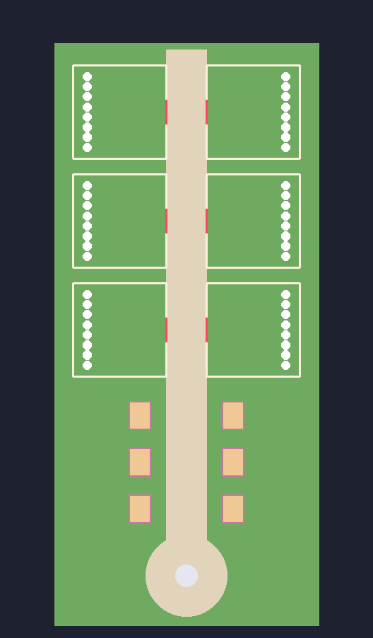
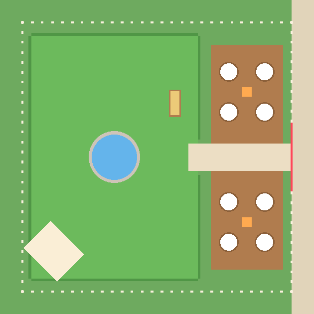

# Cubeling Nest

الكود في `game/` (يتبنى في Roblox بـ `default.project.json`).

## الماب
- **شارع واحد** من الجنوب للشمال:
  - **في البداية ساحة صغيرة** فيها نافورة، وين يظهرو اللاعبين.
  - **من بعد 6 محلات** (`Town.glb`)، 3 في كل جنب قدّام بعضهم. **Egg Shop** هو الأول، و**Food Shop** يبيع الماكلة، والآخرين "Coming soon".
  - **من بعد 6 حدائق** في صفّين قدّام بعضهم، 3 في كل جنب. كل لاعب في السيرفر ياخذ حديقة.
- **كل حديقة** (80×80) دايرين بيها سياج خشب، وفيها **بوابة ليزر** على الشارع. البوابة مفتوحة ديما لصاحبها، ومسكّرة على الآخرين.
  - **باب الحديقة** يدخل طول للمفقس، وفوق الباب اسم صاحب الحديقة. المرعى ياخذ الباقي حتى للسياج اللوراني، في وسطه بركة.
  - **Hatchery قدّام الباب:** أرضية خشب فيها 16 عش (8 على كل جنب من الممرة، صفّين من 4). البيضة تبان بنفس الحجم في العش مهما كانت. كل عش فوق قاعدة حجر وتحت قبة زجاج. الأول حلقتو ذهبية ومحمي.
  - **Pasture:** مرعى كبير (72×53) فيه بركة، المخلوقات يدورو فيه وتطلع فوقهم الدراهم.
  - **المذود (Trough):** تحط فيه الماكلة (🌾 5 دقايق، 🫐 15، 🍎 60) والمخلوقات تربح ×2. الثمن 30% من الربح الزايد. بلا ماكلة يربحو عادي. في Raid Time السارق ياخذ ماكلة وحدة من كل مذود.
  - **Treadmill:** بجنب الممرة في المرعى، تمشي فوقو باش تزيد السرعة.
  - **المخزن (Storage):** حانوت في زاوية المرعى يفتح الشكارة. يهز 60 مخلوق، ويكبر لـ100 ومن بعد 150 بالدراهم.

  

## أول دقيقة
- **لاعب جديد** يلقى بيضة مجانية حاطّة في العش الذهبي تاعو، تفقس في **30 ثانية** (`STARTER_HATCH`).
- **خيط ذهبي** (`Controllers/Guide`) يدلّو وين يروح: العش، ومن بعد Egg Shop. يختفي كي يفقّس 3 مخلوقات.
- حديقتو ما تتسرقش في أول 15 دقيقة.

## الحركة
- **Sprint 🏃:** شد **Shift** (ولا زر **Sprint** في الهاتف) وتجري **×1.5** قد ما تحب، بلا طاقة. ما يخدمش وانت هاز بيضة.
- **الكرسي الطاير ☁️** (`SeatModel` و `RideClient`): اللاعب يبدا يمشي عادي. زر **☁️ Seat** يطلّعو على الكرسي (يقعد متكتّف الرجلين وهو يطير)، و **🚶 Walk** ينزّلو.
  - **على الكرسي:** يمشي **×4** من سرعتو (السرعة اللي درّبها في Treadmill)، حتى **100** على الأكثر.
  - **وهو هاز بيضة** (البرية، الـ Raid، الـ Heist) الكرسي ما يزيدش السرعة، باش المطاردة تبقى عادلة.
  - الكل عندو **Cloud** بلاش. الـ 30 كرسي الآخرين شكل برك (نفس السرعة)، ويتباعو من بعد بالـ Robux.

## اللعب
1. **تشري بيض** من Egg Shop. الستوك يتجدد كل 5 دقايق، وهو نفسو في كل السيرفرات. البيض النادر قليل ما يكون في الستوك.
   - كي تجي بيضة نادرة (مستوى 9 وفوق)، السيرفر كامل يشوف "🌟 ICE EGG IN STOCK!".
   - **الحظ يبان:** كل بيضة في Shop مكتوب تحتها شنو يفقس منها وبقداش %، والطفرات مكتوبين الفوق.
2. **تحط البيضة في حاضنة** في حديقتك. تفقس بالوقت الحقيقي، حتى وانت خارج: دقيقة للمستوى 1، قريب ساعة للأسطورية.
3. **المخلوق يعيش في حديقتك** ويجيبلك دراهم كل ثانية، وحتى وانت خارج (8 سوايع على الأكثر).
4. **الطقس** يتبدّل كل 10 دقايق: البيضة اللي تكمل في طقس خاص تفقس على الأقل بنفس الطفرة (Golden، Crystal، Lava، Neon).
5. **من الشكارة (Bag):** تحط المخلوقات في الحديقة، ترجّعهم، ولا تبيعهم، وتشري بلاصة زايدة. الحاضنات الزايدة تشريهم في الحديقة نيشان.
6. **Raid Time** (`Config/Raid`):
   - **وقتاش:** كل 10 دقايق تتحل كامل البوابات مع بعض لمدة دقيقة. هي نفسها في كل السيرفرات، وما كاينش قفل يدوي.
   - **واش يتسرق:** تقدر تدخل حديقة غيرك وتسرق **بيضة من حاضنة**. المخلوقات ما يتسرقوش أبدا.
   - **المحمي:** الحاضنة الأولى (الذهبية)، ولاعب جديد في أول 15 دقيقة تاعو.
   - **السارق:** يمشي بالشوية وهو هاز البيضة.
     - **إذا مسّو صاحب الحديقة** ترجع البيضة.
     - **إذا ما وصلش لحديقتو قبل ما تتسكّر البوابات،** ولا خرج ولا طاح، ترجع البيضة لصاحبها.
     - **إذا وصل،** البيضة تكمل الفقس عندو بنفس الوقت.
     - **لازم يكون عندو حاضنة فارغة** باش يقدر يسرق.
   - **عادل للي يتسرق:**
     - كل حديقة تخسر **بيضة وحدة على الأكثر** في كل Raid.
     - يتقال للكل **30 ثانية** قبل.
     - **السيرفرات الخاصة Peaceful 🕊️:** ما كاينش Raid Time فيهم أصلاً. (لازم تحط ثمن Private Server = 0 في إعدادات اللعبة في Roblox باش يكونو بلاش.)
   - **المخلوقات يحرسو الحديقة:**
     - في Raid Time يجريو ورا أي واحد دخل لحديقة ماشي تاعو.
     - كل ثانية السارق اللي هاز بيضة في الحديقة، المخلوقات يقدرو يدفّوه ("💥 BONK!") ويمشي بالشوية ثانية. الحظ يزيد مع العدد والطفرة (Normal = 1 ... Neon = 5).
     - **Lava** يحرق: يبطّا ثانيتين. **Crystal** يزلّق: يدفعو لجنب. **Neon** يضوّي السارق باش الكل يشوفوه.
   - **البيضة تتذكر دارها:**
     - اللي يفقس من بيضة مسروقة يكون **Homesick 🏠**: يبعث **20%** من دراهمو للي تسرقت منو، حتى وهو خارج ولا في سيرفر آخر.
     - السارق يقدر يرجّعو لدارو من الشكارة (**🏠 Home**) ويربح ×2 ثمن البيع، والمخلوق يرجع لصاحبو.
     - إذا سرقت بيضتك وترجعها، ما تكونش Homesick.
7. **أم المكعبات (Mother Cube)** (`Config/Mother`):
   - **وقتاش:** كل ساعة على **xx:35** (بين جوج Raids)، مكعبة عملاقة جوعانة تنزل فوق النافورة لمدة دقيقتين. يتقال للكل قبل بدقيقة. في Studio تجي كل 5 دقايق للتجربة.
   - **كيفاش:** الكل يأكّلها مع بعض (**Feed**). تاخذ أصغر ماكلة عندك (🌾 = 1، 🫐 = 3، 🍎 = 10)، ولا تشري snack 🍪 بـ 60 ثانية من ربح حديقتك (= 1).
   - **الجوع:** 6 نقاط على كل لاعب في السيرفر (8 على الأقل).
   - **إذا شبعت:** كل واحد أكّلها ياخذ بيضة من أحسن مستوى فقّسو، وكل نقطة عطاها تزيد **2%** حظ باش تكون **Legendary Egg** (حتى 25%).
   - **إذا ما شبعتش:** تروح وما تعطي والو.
8. **Cube Snap 🧊** (`Config/Snap`): من الشكارة، زر "🧊 Snap" يبان كي يكون عندك 4 كيف كيف.
   - **4 مخلوقات** من نفس النوع ونفس الطفرة = **Mega** (أكبر، يربح ×5، يحرس ×2).
   - **4 Mega** من نفس النوع (أي طفرة) = **Rainbow** 🌈 (أكبر بزاف، يضوي بالألوان، يربح ×25، يحرس ×4)، وياخذ أحسن طفرة فيهم. السيرفر كامل يشوف.
   - المخلوق Homesick ما يتلصقش. اللي في الحديقة يتاخذو آخر واحد.
9. **المهام اليومية 📋** (`Config/Daily`): كل نهار (UTC) 3 مهام، نفسهم للكل، من: فقّس 3 بيضات، اشري 2 بيضات، أكّل المخلوقات، أكّل أم المكعبات، جيب بيضة من البرية.
   - كي تكمّلهم، زر **📋 Daily** يولّي ذهبي **🎁**، وتاخذ **بيضة بلاش** من أحسن مستوى فقّستو.
10. **Egg Heist** في الويكاند: بيضة ذهبية تطيح حذا النافورة، توصّلها لحديقتك وتربح بيض.

## البرية (كيما Steal An Egg)

- **ماب ثانية** من بعد البوابة اللي في آخر الشارع (ولا بزر **🌿 Wild**). فيها طريق يفوت على **8 مناطق** وحدة من بعد وحدة: Meadow، Flower Field، Forest، Beach، Cave، Desert، Snow، Volcano. كل منطقة فيها **4 عشوش** فيهم بيض من نوعها (بيض 1 حتى 8).
- **السرقة:** تقرب لعش، تضغط **Steal** (نص ثانية)، وتجري ترجع للبوابة. البيضة تثقلك (90% من سرعتك). كي تفوت البوابة، البيضة تروح للشكارة.
- **الحراس:** زوج في كل منطقة (مخلوق كبير من نفس المنطقة). الأقرب يجري موراك، وأي حارس تفوت قدّامو يشوفك. إذا حكمك، البيضة ترجع للعش وانت ترجع للبوابة.
- **السرعة (⚡):** تبدا بـ16. كل منطقة مكتوب عليها شحال تحتاج باش تهرب (Meadow 15، Flower 18 ... Volcano 48). تطلّعها بـ**Treadmill** اللي في الحديقة: تطلع فوقو وتمشي. الـconsole يكبّرو (5 مستويات، 2.5K حتى 2.5M). أقصى سرعة 70.
- **العشوش يتعمرو** كل 5 دقايق.
- **Egg Shop** يبيع غير البيض 1–3 و9–11. البيض 4–8 يجي غير من البرية.

## الإعدادات
- `game/shared/Config/`: `Creatures`، `Eggs`، `Mutations`، `Weather`، `Island`، `Shop`، `Raid`، `Heist`.
- الأصول 3D: `Art.luau` (الـ IDs) و `CreatureLooks` و `TownLooks` و `PropLooks` و `SeatLooks`.

## الاختبارات
`lune run tests/game.luau` و `lune run tests/game_world.luau`
