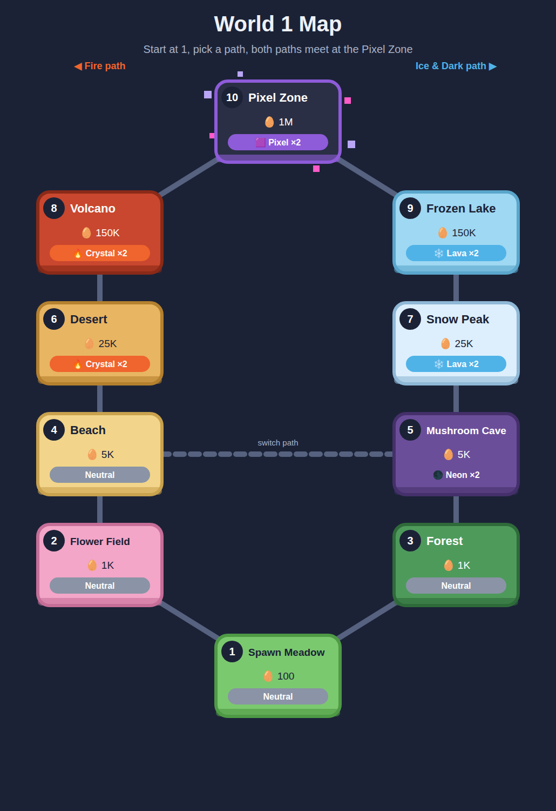

# العالم الأول

كل الأرقام مقترحة، وتتضبط في التجربة.

## الخريطة
- **البداية:** المنطقة 1، ومن بعد اللاعب يختار طريق
  - **طريق النار (يسار):** Flower Field ← Beach ← Desert ← Volcano
  - **طريق الثلج والظلام (يمين):** Forest ← Mushroom Cave ← Snow Peak ← Frozen Lake
- **تبديل الطريق:** ممكن بين Beach و Mushroom Cave
- **النهاية:** الطريقين يتلاقاو في **Glitch Zone**
- **المناطق في نفس المستوى** (مثلا Desert و Snow Peak) عندهم نفس ثمن البيض، لكن أنواع ومهارات مختلفة. هكذا الاختيار مهم.

## المناطق
| # | المنطقة | العنصر | ثمن البيضة | حارس المنطقة (Titan) |
|---|---------|--------|------------|----------------------|
| 1 | Spawn Meadow | عادي | 100 | Bear |
| 2 | Flower Field | عادي | 1K | Uni |
| 3 | Forest | عادي | 1K | Sprout |
| 4 | Beach | عادي | 5K | Octopus |
| 5 | Mushroom Cave | ظلام 🌑 (Neon ×2) | 5K | Shade |
| 6 | Desert | نار 🔥 (Crystal ×2) | 25K | Sphinx |
| 7 | Snow Peak | ثلج ❄️ (Lava ×2) | 25K | Yeti |
| 8 | Volcano | نار 🔥 (Crystal ×2) | 150K | Phoenix |
| 9 | Frozen Lake | ثلج ❄️ (Lava ×2) | 150K | Ice Dragon |
| 10 | Glitch Zone | Glitch 👾 (Glitch ×2) | 1M | King |

**حارس المنطقة** هو أندر نوع في بيضتها، يطلع كـ Titan كي ترجّع المنطقة لـ 100%.

## البيض والأنواع والمهارات
- **الفرص في كل بيضة:** 60% / 30% / 9% / 1%
- **القوة:** شحال من عملة يجمع في الضربة (للدرجة Normal)
- **مهارات Big:** تبدا بسيطة وتقوى مع المناطق
- **مهارات Titan:** **كلها قوية**، حتى في المنطقة الأولى، لأن Titan نادر بزاف
- **نفس المهارة ما تتجمعش،** تتحسب الأقوى برك

### 1. Spawn Meadow
| النوع | الفرصة | القوة | مهارة Big | مهارة Titan |
|-------|--------|-------|-----------|-------------|
| Cubby | 60% | 1 | سرعة الفريق +25% | حظ الفقس ×3 |
| Kitty | 30% | 2 | أكوام العملات +25% | فرصة Jackpot ×5 |
| Bunny | 9% | 3 | سرعة الفريق +50% | مطر عملات كل دقيقة |
| Bear | 1% | 5 | الصناديق +50% | قوة كل المخلوقات ×2 |

### 2. Flower Field
| النوع | الفرصة | القوة | مهارة Big | مهارة Titan |
|-------|--------|-------|-----------|-------------|
| Bee | 60% | 3 | مغناطيس (مدى صغير) | 10% من المصادر يولّيو ذهب (×10) |
| Ladybug | 30% | 5 | أكوام العملات +50% | فرصة Golden ×5 |
| Butterfly | 9% | 8 | 3% فرصة جوهرة من كل مصدر | 10% فرصة جوهرة من كل مصدر |
| Uni | 1% | 12 | يضرب ضربتين | كل بيضة تعطي 2 مخلوقات |

### 3. Forest
| النوع | الفرصة | القوة | مهارة Big | مهارة Titan |
|-------|--------|-------|-----------|-------------|
| Fox | 60% | 3 | سرعة الفريق +50% | Big يظهر ×5 أكثر، وفرصة الصيد 50% |
| Owl | 30% | 5 | الصناديق +75% | أرباح الغياب ×5 |
| Deer | 9% | 8 | مغناطيس (مدى متوسط) | الدمج بـ 2 بدل 5 |
| Sprout | 1% | 12 | Stomp كل 15 ثانية | كل المصادر تعاود تخرج فوراً |

### 4. Beach
| النوع | الفرصة | القوة | مهارة Big | مهارة Titan |
|-------|--------|-------|-----------|-------------|
| Crab | 60% | 8 | الخزنات +50% | Smash: يكسّر أكبر مصدر كل 30 ثانية |
| Turtle | 30% | 12 | الـ Combo ما يطيحش لمدة 3 ثواني | الـ Combo ما يطيحش أبداً |
| Dolphin | 9% | 20 | يضرب ضربتين | كل العملات ×2 |
| Octopus | 1% | 30 | Stomp كل 10 ثواني | كل دقيقة: 10 ثواني كلش ×10 |

### 5. Mushroom Cave
| النوع | الفرصة | القوة | مهارة Big | مهارة Titan |
|-------|--------|-------|-----------|-------------|
| Mushroom | 60% | 8 | 5% فرصة جوهرة من كل مصدر | فرصة Neon ×5 |
| Bat | 30% | 12 | مغناطيس (مدى كبير) | مغناطيس المنطقة كاملة، وسرعة الفريق ×3 |
| Glowworm | 9% | 20 | الفريق +50% في المناطق المظلمة | مكافأة العنصر ×4 بدل ×2 |
| Shade | 1% | 30 | الـ Combo ما يطيحش لمدة 5 ثواني | ينسخ أقوى مخلوق في الفريق ×2 |

### 6. Desert
| النوع | الفرصة | القوة | مهارة Big | مهارة Titan |
|-------|--------|-------|-----------|-------------|
| Camel | 60% | 20 | سرعة الفريق ×2 | 50% فرصة الفقس يكون مجاني |
| Scorpion | 30% | 30 | الخزنات +100% | Smash كل 20 ثانية |
| Cactus | 9% | 50 | 10% فرصة الفقس يكون مجاني | حظ الفقس ×5 |
| Sphinx | 1% | 75 | Stomp كل 8 ثواني | كل العملات ×3 |

### 7. Snow Peak
| النوع | الفرصة | القوة | مهارة Big | مهارة Titan |
|-------|--------|-------|-----------|-------------|
| Penguin | 60% | 20 | الصناديق +100% | فرصة Lava ×5 |
| Seal | 30% | 30 | يضرب ضربتين | المناطق ترجع ×3 أسرع، والحراس يرجعو ×4 أسرع |
| Snowman | 9% | 50 | 15% فرصة الفقس يكون مجاني | 25% من المصادر يولّيو ذهب (×10) |
| Yeti | 1% | 75 | Stomp كل 8 ثواني | **قوة كل المخلوقات ×2.5** |

### 8. Volcano
| النوع | الفرصة | القوة | مهارة Big | مهارة Titan |
|-------|--------|-------|-----------|-------------|
| Imp | 60% | 50 | 8% فرصة جوهرة من كل مصدر | مطر عملات كل 30 ثانية |
| Salamander | 30% | 75 | الـ Combo ما يطيحش لمدة 8 ثواني | فرصة Jackpot ×10 |
| Golem | 9% | 125 | الخزنات +200% | كل مخلوقات الفريق ياخذو مهارة Stomp |
| Phoenix | 1% | 190 | Stomp كل 5 ثواني | ينسخ أقوى مخلوق في الفريق ×3 |

### 9. Frozen Lake
| النوع | الفرصة | القوة | مهارة Big | مهارة Titan |
|-------|--------|-------|-----------|-------------|
| Ice Fox | 60% | 50 | سرعة الفريق ×3 | أرباح الغياب ×10 |
| Narwhal | 30% | 75 | مغناطيس (المنطقة كاملة) | كل بيضة تعطي 3 مخلوقات |
| Frost Owl | 9% | 125 | 20% فرصة الفقس يكون مجاني | حظ الفقس ×10 |
| Ice Dragon | 1% | 190 | Stomp كل 5 ثواني | Smash كل 10 ثواني |

### 10. Glitch Zone
| النوع | الفرصة | القوة | مهارة Big | مهارة Titan |
|-------|--------|-------|-----------|-------------|
| Bot | 60% | 125 | +100% عملات في Glitch Rift | فرصة Glitch ×5 |
| Pixel | 30% | 190 | يضرب 3 ضربات | كل العملات ×5 |
| Bug | 9% | 300 | الـ Combo ما يطيحش لمدة 10 ثواني | كل 30 ثانية: 10 ثواني كلش ×10 |
| King | 1% | 500 | Stomp كل 3 ثواني | **قوة كل المخلوقات ×3** |
